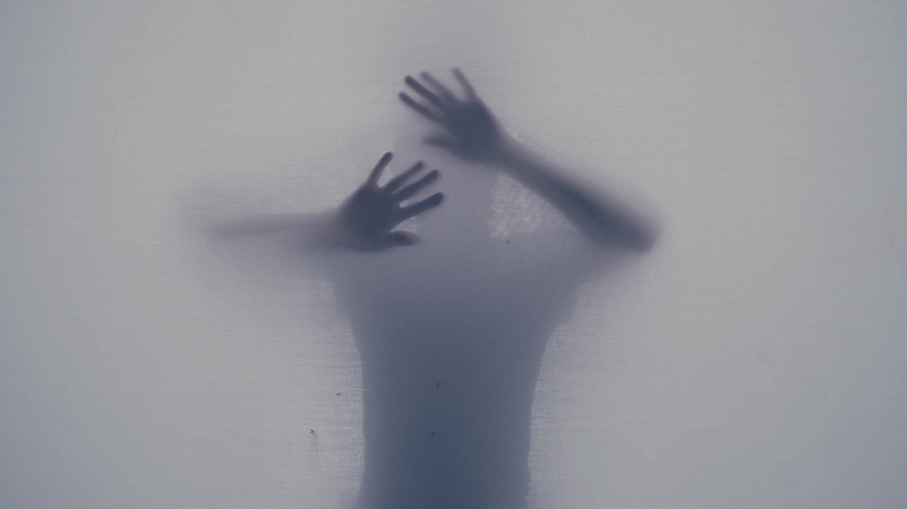

En un principio tenia planeado nombrar este primer artículo de mi blog, con el titulo de "¿Cómo superé mi pérdida de ..." pero pensándolo un poco, podría sonar un poco pretencioso y a la vez algo engañoso para mí mismo, si tengo en cuenta, que mi estado actual, el cual mencionaré en brevedad, no ha sido superada del todo, y que por el contrario debido a la magnitud del suceso para mi vida, hay momentos y situaciones en las que considero que aún no lo he superado en su totalidad. Además porqué desconozco el futuro, y no se cómo reaccione a lo que este traiga. Pues bien considero que una mejor palabra para acompañar este tiulo sería "afrontar", porqué denota para mí, una lucha constante, siempre buscando dar lo mejor de si.

Quiero iniciar mi blog personal narrando un poco el evento inoportuno de mi vida que me llevó a perder casi el 70% de mi capacidad visual, y cómo poco a poco y con muchas dificultades principalmente emocionales, fuí encontrando uno o varios caminos quizás, que me llevaron a un punto el cual nunca imaginé poder alcanzar. Conseguí con esto entonces, poder llevar una vida normal, no igual a como era antes, pero si con algunos "hacks" aprendidos que hacen mas ligera la carga del problema.

De niño siempre contaba con algún que otro sueño por cumplir, y actualmente como cualquier otro ser humano los sigo teniendo. Las experiencias me han moldeado desde entonces y quizás ya no sean los mismos sueños de chico, pero sigo teniendo otros por alcanzar y muchos otros que he logrado presenciar. Lo más probable es que todos nosotros siempre tengamos algún ideal que nos empuje a querer darlo tooo para llegar ahí, sin importar que tan dificil se nos presente el camino.

Es Aquí donde el hecho de tener siempre un ideal se convirtió en una de las fuerzas motoras más grandes que tuve, junto al apoyo intrinseco de toda mi familia, para poder reponerme a la debacle que represento para mi vida emocional y profesional el perder aproximadamente un 70% de mi capacidad visual.

> “Soñé que iba a ser ejecutado. De repente me di cuenta de que había muchas cosas que valía la pena que podía hacer, si me dieran un respiro"
  
Stephen Hawking

Soy Robert Stevens, y en mis últimos 15 años aproximadamente me he dedicado a ser desarrollador de software, primero motivado por una gran pasión y luego acompañado de una profesión. Soy Ingeniero de Sistemas y Computación, egresado de la Universidad del Quindio, y he logrado brindar mis conocimientos a la industria del software, ejerciendo cargos afines con esta profesión. Tengo el placer de contar con una Mamá que supo darlo todo para sacar adelante a sus dos hijos, y la cual siempre admiraré por su gran labor como Madre, tengo un hermano mellizo al que respeto y admiro mucho, y al que literalmente por anécdotas de la vida, le debo la misma. Tengo un hermoso fiel amigo de cuatro patas 🐶 llamado Canelo y pertenezco a una gran familia, a la cual desde siempre he querido mucho.

Si bien, en estos momentos desempeño normalmente mis actividades como Desarrollador de Sofrware y llevo una vida común y corriente, con sus limitantes y todo, esto es debido a la resiliencia alcanzada hasta el momento para levantarme de una etapa muy dificil en mi vida, marcada por el acontecimiento de haber perdido gran parte de mi capacidad visual.

Antes de empezar a escribir que pasó exactamente y como fueron ocurriendo los diferentes hechos al rededor del tema, quiero dejar claro, que pese a que es un tema muy personal, desde un principio he querido dejarlo plasmado de alguna manera, y una de las mejores alternativas que he encontrado, es mediante un texto, y aprovecho esta ocasión para retomar viejos gustos y pasatiempos, como es el grandioso hábito de la escritura.

> “No son las cosas que nos pasan las que nos hacen sufrir, sino lo que nos decimos sobre estas cosas”.
  
Epícteto

## Un Agridulce 2016

El 2016 había comenzado de una manera grandiosa, y es que en aquel entonces había logrado alcanzar un par de sueños, el más memorable quizás para mí fue haber conocido el mar, y sí, sé que como muchas otras personas, este es uno de esos sueños por cumplir y para otras quizás sea algo trivial, pero en aquel momento ya había hecho el "check" en mi propia lista... ¡Era un año genial!

En esos momentos sentia que las cosas marchaban muy bien a consideración muy personal, de igual manera fue el año en el cual conseguí mi titulo profesional como Ingeniero de Sistemas después de una tortuosa espera, en la que se habia postergado un par de años, aún habiendo terminado de cursar todos los créditos. Y por supuesto fue el año en el que adopté y conocí a mi fiel amigo Canelo, un fábuloso perro que me ha brindado una compañía que más adelante se iba a convertir en una ayuda sin igual, para enfrentar la crisis emocional que llevaría el evento de mi pérdida visual.

## Contexto

Con el fin de no ahondar bastante en detalles, la razón principal por la cual las cosas ocurrieron de esta manera, es debido a que desde muy pequeño, aproximadamente un año de edad, sufrí un accidente, el cual derivó en una anomalía conocida como *[Hidrocefalia](https://es.wikipedia.org/wiki/Hidrocefalia)*, y la manera de tratarla es mediante una *derivación ventriculoperitoneal*.

Este sistema de derivación es algo que debo tener en mi cuerpo a lo largo de toda mi vida, y hasta el momento ha sido actualizada una vez, en el año 2007 por motivos relacionados principalmente con el crecimiento (Actualización del firmware 😜). Es un dispositivo que me permite tener a *raya*  esta anomalía y poder llevar una vida normal como cualquier otra persona.

En los años previos al 2016, una de las molestias más comunes que presentaba, eran fuertes dolores de cabeza y migrañas severas, hasta el punto en que perdia fuerza en todas las extremidades. Las consultas médicas eran muy monótonas, pues siempre recibía el mismo criterio médico que atribuian los síntomas principalmente a un tema de estrés.

## Apagones

Fueron muchas las ocasiones en las que acudia al médico por las molestias mencionadas, sin recibir un parte mas específico y controlado, hasta que cierto dia del año 2016, mientras jugaba videojuegos, instantaneamente mi ojo derecho se apagó sin más, quedando solo a oscurás. Inevitablemente el susto fué inmenso por lo ocurrido, así que suspendi lo que estaba haciendo en el momento y me quedé inmóvil pensando que podría estar pasando y temeroso de que algo grave estuviera ocurriendo en ese preciso momento.

Mi sorpresa fue notar que pasado unos cuantos segundos, el ojo empezaba a recobrar su luz y por ende su capacidad visual, este proceso ocurria de manera paulatina hasta quedar nuevamente a su estado "natural".

No lo comenté con ninguna persona ese mismo dia porqué no quería generar algún tipo de alarma. Pero al día siguiente cuando volvió a suceder, claramente mis peores temores fueron surgiendo nuevamente y es aquí donde doy a viso en ese entonces a mi Madre de lo que me estaba pasando.

El siguiente paso fue empezar a buscar la ayuda médica requerida del caso y pensando en lo tortuoso y desgastante que podría ser acudir al sistema de salud contributivo, lo primero que hice era buscar ayuda profesional privada con oftalmología.

## Rueda de la fortuna

Todo empezó a complicarse por diversas razones. Los síntomas se hacían más frecuentes, los apagones en el ojo derecho eran más notorios y el miedo iba en crecimiento. Era una situación a la cual no sabía como enfrentar, ya que no había mucho que estuviera en mis manos por hacer, nada más que depender de ayuda médica especializada y esperar. Y sí eso fué lo que pasó, una gran espera.

Acudíendo a más de 10 especialistas desde Oftalmólogos, Retinólogos, Neurólogos y por supuesto Neurocirujanos, la triste realidad era que no sabían a que atribuir los síntomas. Los éxamenes eran correctos sin ningún tipo de anomalías, principalmente hidrocefalia, la cual estaba primera en la lista de busqueda.

WIP

